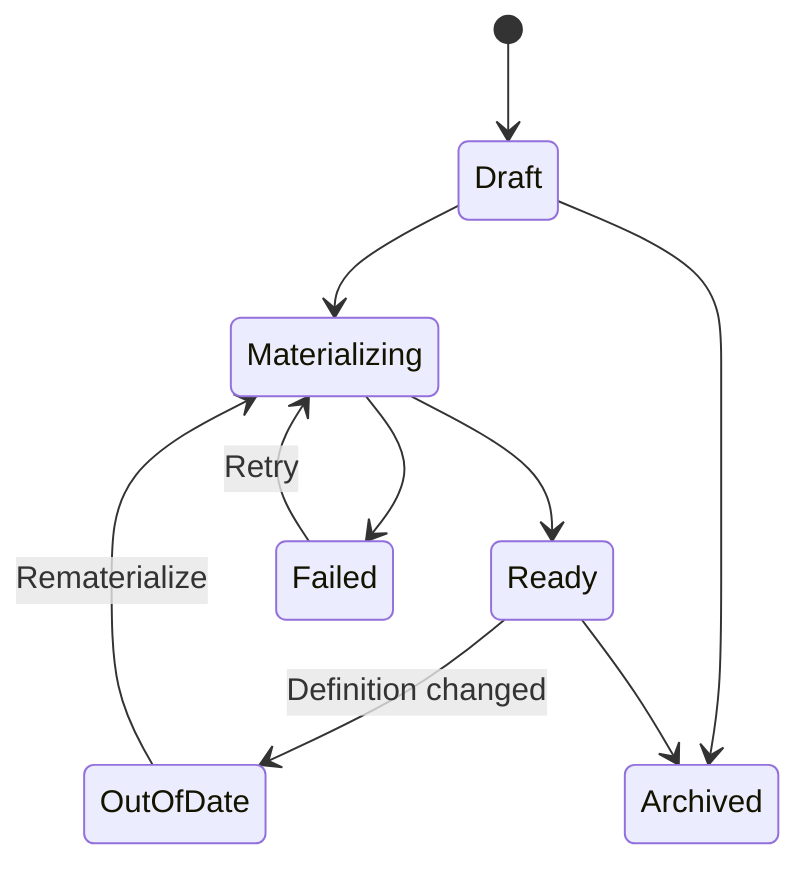
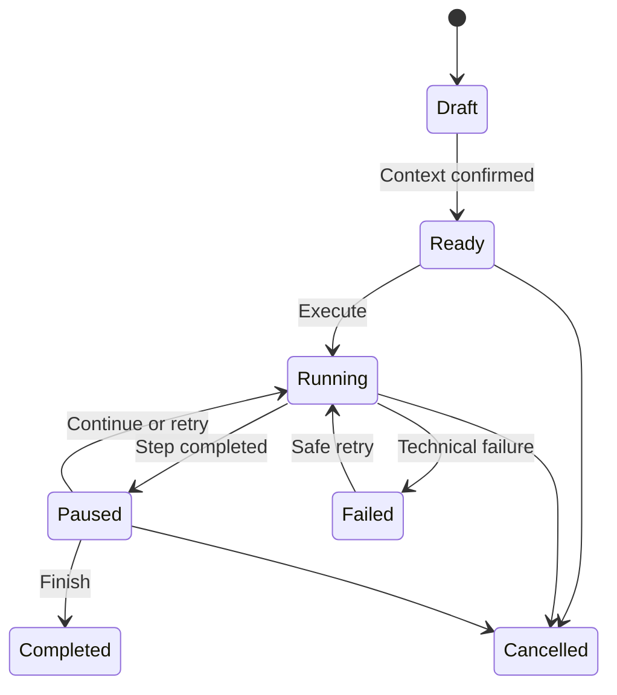

# Admin API and state model

## Purpose

Этот документ переводит backend contract в frontend-facing state без
привязки к framework/store/query library.

Canonical backend contract:
[../be/API_CONTRACT.md](../be/API_CONTRACT.md).

## Source of truth

### Server-owned

- Profile definition/status.
- Sandbox materialization status.
- Capability/flow catalog.
- Context preview result/hash.
- Run/Step status/input/output/artifacts.
- Reviews.
- Issues.
- Cases/Suites.
- System Versions.

### Client-owned temporary state

- unsaved Profile field edits;
- chat draft;
- unconfirmed assistant changeset;
- unsubmitted context overrides;
- unsaved human review;
- open/collapsed panels;
- current filters.

Client не должен оптимистично считать LLM execution completed.

## View models

Ниже conceptual interfaces. Имена адаптируются к actual admin conventions.

### Profile summary

```ts
type QaProfileSummary = {
  id: string;
  name: string;
  segment: string;
  source: 'ai_generated' | 'fixture_import' | 'real_clone';
  status:
    | 'draft'
    | 'materializing'
    | 'ready'
    | 'out_of_date'
    | 'failed'
    | 'archived';
  sandboxUserId: string | null;
  counts: {
    notes: number;
    themes: number;
    postSamples: number;
  };
  updatedAt: string;
};
```

### Profile detail

```ts
type QaProfileDetail = QaProfileSummary & {
  definition: {
    profile: Record<string, unknown>;
    goals: string[];
    pillars: string[];
    toneRules: string[];
    strategyState: string[] | Record<string, unknown>;
    notes: {
      raw: string[];
      noisy: string[];
    };
    postSamples: Array<{ id?: string; text: string }>;
    [extension: string]: unknown;
  };
  sourceUserId: string | null;
  materialization: MaterializationState;
  suggestedTasks: unknown[];
};
```

### Assistant changeset

```ts
type ProfileChangeSet = {
  assistantMessage: string;
  scope: 'local' | 'bulk';
  requiresConfirmation: boolean;
  draftRevision: number;
  changes: Array<{
    operation: 'set' | 'append' | 'replace' | 'remove';
    path: string;
    value?: unknown;
  }>;
};
```

### Capability

```ts
type CapabilityDefinition = {
  key: string;
  label: string;
  description: string;
  status: 'ready' | 'limited' | 'deferred' | 'support';
  inputSchema: unknown;
  defaultRubric: RubricCriterion[];
  allowedNext: string[];
};
```

Deferred capabilities можно показывать disabled только если это помогает
объяснить scope; default picker показывает ready/limited.

### Context preview

```ts
type ContextPreview = {
  profileId: string;
  sandboxUserId: string;
  capabilityKey: string;
  input: Record<string, unknown>;
  context: Array<{
    key: string;
    source: 'product_default' | 'case' | 'operator_override' | 'prior_step';
    ids: string[];
    summary: string;
    details?: unknown;
  }>;
  warnings: Array<{
    code: string;
    message: string;
    blocking: boolean;
  }>;
  contextHash: string;
};
```

### Run and Step

```ts
type QaRun = {
  id: string;
  profileId: string;
  caseId: string | null;
  suiteId: string | null;
  systemVersionId: string;
  kind: 'atomic' | 'guided';
  status:
    | 'draft'
    | 'ready'
    | 'running'
    | 'paused'
    | 'completed'
    | 'failed'
    | 'cancelled';
  contextPolicy: 'exact' | 'product_defaults';
  steps: QaRunStep[];
  currentStepKey: string | null;
  reviews: QaReview[];
  issues: QaIssue[];
  nextActions: RunAction[];
  summary: Record<string, unknown> | null;
};

type QaRunStep = {
  key: string;
  order: number;
  capabilityKey: string;
  status: 'pending' | 'running' | 'completed' | 'failed' | 'skipped';
  attempts: QaStepAttempt[];
  selectedAttemptId: string | null;
  operatorSelection: unknown | null;
  nextActions: RunAction[];
};

type QaStepAttempt = {
  id: string;
  input: Record<string, unknown>;
  resolvedContext: ContextPreview | Record<string, unknown>;
  output: unknown | null;
  artifacts: Record<string, unknown>;
  error: QaError | null;
  durationMs: number | null;
  startedAt: string | null;
  completedAt: string | null;
};
```

### Review

```ts
type RubricCriterion = {
  key: string;
  label: string;
  description: string;
  anchors: Array<{ score: number; description: string }>;
};

type QaReview = {
  id: string;
  runId: string;
  stepKey: string | null;
  reviewerType: 'ai' | 'human';
  overallScore: number;
  criteria: Array<{
    key: string;
    score: number;
    rationale?: string;
    comment?: string;
    anchorsSnapshot: RubricCriterion['anchors'];
  }>;
  comment: string | null;
  createdAt: string;
  updatedAt: string;
};
```

Effective display rule:

```text
human score exists → human
otherwise → AI
otherwise → unreviewed
```

Нельзя объединять AI и human values в один mutable object.

### Issue

```ts
type QaIssue = {
  id: string;
  runId: string;
  stepKey: string | null;
  capabilityKey: string;
  title: string;
  description: string | null;
  severity: 'minor' | 'major' | 'critical';
  status: 'open' | 'fixed' | 'ignored';
  resolutionRunId: string | null;
  createdAt: string;
  updatedAt: string;
};
```

### System Version

```ts
type QaSystemVersion = {
  id: string;
  label: string;
  description: string | null;
  role: 'baseline' | 'candidate' | 'archived';
  available: boolean;
  codeRevision: string | null;
  isDirty: boolean;
  models: Record<string, string>;
  prompts: Record<string, string>;
  runtime: Record<string, unknown>;
  createdAt: string;
};
```

## State machines

### Profile



UI actions должны зависеть от server status, а не локальной догадки.

### Run



Atomic Run обычно идёт `Ready → Running → Completed`, но backend может
вернуть `Paused` для review; UI следует response.

### Step

```text
pending → running → completed
                  ↘ failed
pending → skipped
failed → new attempt running
completed → new retry attempt only by explicit action
```

### Issue

```text
open → fixed
open → ignored
fixed → open
ignored → open
```

## Quick Test client state

```ts
type QuickTestDraft = {
  profileId: string | null;
  systemVersionId: string | null;
  mode: 'atomic' | 'guided';
  capabilityKey: string | null;
  flowKey: string | null;
  input: Record<string, unknown>;
  contextOverrides: Record<string, unknown>;
  contextPreview: ContextPreview | null;
  contextPreviewStatus: 'idle' | 'loading' | 'ready' | 'error';
  createRunStatus: 'idle' | 'submitting' | 'error';
};
```

Rules:

- Changing Profile/capability/input invalidates context preview.
- `Run` disabled until non-blocking fresh preview.
- Reset overrides creates new preview.
- Draft may live locally; created Run lives on server.

## Profile editor state

```ts
type ProfileEditorState = {
  serverProfile: QaProfileDetail;
  draftDefinition: QaProfileDetail['definition'];
  draftRevision: number;
  dirtyPaths: string[];
  lockedPaths: string[];
  pendingChangeSet: ProfileChangeSet | null;
  undoStack: unknown[];
  assistantStatus: 'idle' | 'sending' | 'error';
  saveStatus: 'idle' | 'saving' | 'error';
};
```

Rules:

- Pending bulk changeset не входит в draft до Apply.
- Local auto-applied assistant change всё равно добавляется в undoStack.
- Server save использует revision/updatedAt для stale protection.
- Materialize доступен только после successful save.

## Runner state

Server Run detail должен быть достаточен для восстановления после reload.
Дополнительный local state:

```ts
type RunnerLocalState = {
  openStepKey: string | null;
  openAttemptId: string | null;
  inputDraft: Record<string, unknown>;
  selectionDraft: unknown | null;
  humanReviewDraft: Record<string, unknown> | null;
  detailsOpen: boolean;
  reviewAssistantThread: unknown[];
};
```

Не хранить только локально:

- выбранную Idea после Continue;
- completed output;
- score после Save;
- current Step status.

## Polling/refresh semantics

Implementation зависит от существующей admin data layer, но contract:

- после execute request, UI использует returned state;
- если connection lost, GET Run until terminal/paused state;
- не отправлять второй execute, пока status unknown;
- backoff/poll interval bounded;
- stop polling на completed/failed/cancelled/paused.

Streaming не требуется v1.

## API operation mapping

### Home

- `GET /profiles?status=ready`
- `GET /system-versions`
- `GET /capabilities`
- `GET /runs?take=...`
- `GET /issues?status=open&take=...`

Не блокировать Home целиком, если secondary lists failed.

### Profiles

- CRUD `/profiles`
- assistant `/profiles/:id/seed-assistant/messages`
- materialization endpoints.

### Quick Test

- `POST /context/preview`
- `POST /runs`

### Runner

- `GET /runs/:id`
- execute/retry/select/continue/skip/complete/cancel.

### Review

- AI review;
- human review;
- create Issue.

### Tests

- Cases/Suites CRUD;
- Case/Suite run shortcuts.

### Compare

- compare existing Runs;
- optional AI diff;
- preference.

## Context overrides

Admin отправляет only explicit differences:

```ts
type ContextOverrides = {
  noteIds?: string[];
  strategyId?: string | null;
  themeId?: string | null;
  voiceId?: string | null;
  platform?: string;
  [capabilitySpecific: string]: unknown;
};
```

Backend возвращает полный resolved result. Admin:

- не воспроизводит resolver;
- не сохраняет human-readable label как source of truth вместо ID;
- показывает source badge из response.

## Exact rerun

Before create:

1. GET source Run/Case.
2. Select available System Version.
3. Request rerun with `contextPolicy: exact`.
4. Backend проверяет ability.
5. UI показывает warnings.

Если exact невозможен:

- не fallback автоматически на product defaults;
- предложить operator выбрать `Run as product now`.

## Compare state

```ts
type CompareView = {
  baselineRun: QaRun;
  candidateRun: QaRun;
  contextComparable: boolean;
  rubricComparable: boolean;
  warnings: string[];
  stepPairs: Array<{
    stepKey: string;
    baseline: QaRunStep | null;
    candidate: QaRunStep | null;
    scoreDelta: Record<string, number | null>;
  }>;
  preference: 'baseline' | 'candidate' | 'tie' | 'incomparable' | null;
  comment: string;
};
```

UI не вычисляет comparability только по labels; использует backend result.

## Error model

```ts
type QaError = {
  code: string;
  message: string;
  details?: Record<string, unknown>;
};
```

Client handling categories:

- Auth → existing admin auth flow.
- Validation → field/path errors.
- Stale state → refresh and preserve unsaved draft where safe.
- Run state conflict → reload Run.
- Execution failed → Step error/retry.
- Review failed → result remains available.
- Unknown → generic error + correlation/reference if backend returns one.

## Optimistic updates

Allowed:

- expand/collapse;
- local Profile draft;
- score input before Save;
- filters;
- Case order draft before Save.

Avoid optimistic success for:

- materialization;
- Step execute;
- Issue fixed;
- System Version capture;
- real clone;
- Run completion.

## Cache/invalidation principles

Без привязки к library:

- Profile mutation invalidates profile detail/list.
- Materialization invalidates Profile + ready Profile pickers.
- Run mutation invalidates Run detail/list and related Case/Suite summary.
- Review mutation invalidates Run detail/summary.
- Issue mutation invalidates Run/Issue/Home summary.
- System Version capture invalidates version selector/list.

## Capability-specific rendering

Backend catalog динамический, но known capabilities имеют richer UI.

Fallback renderer должен уметь:

- показать input JSON;
- показать text/JSON output;
- выполнить generic review;
- показать errors/details.

Это позволяет backend добавить capability до dedicated admin renderer, но
deferred/unsupported capability не должна случайно появляться как ready.

## Privacy

- Не хранить bearer token в Run/Profile.
- Не логировать full Profile definition client-side.
- Real clone content показывать только authorized operator.
- Copy/export actions для real content должны быть explicit.
- Raw provider errors sanitizable server-side.

## API drift process

Если backend contract изменился:

1. обновить [../be/API_CONTRACT.md](../be/API_CONTRACT.md);
2. обновить этот файл;
3. обновить affected screen/task acceptance criteria;
4. не держать второй неофициальный contract только в client code.
