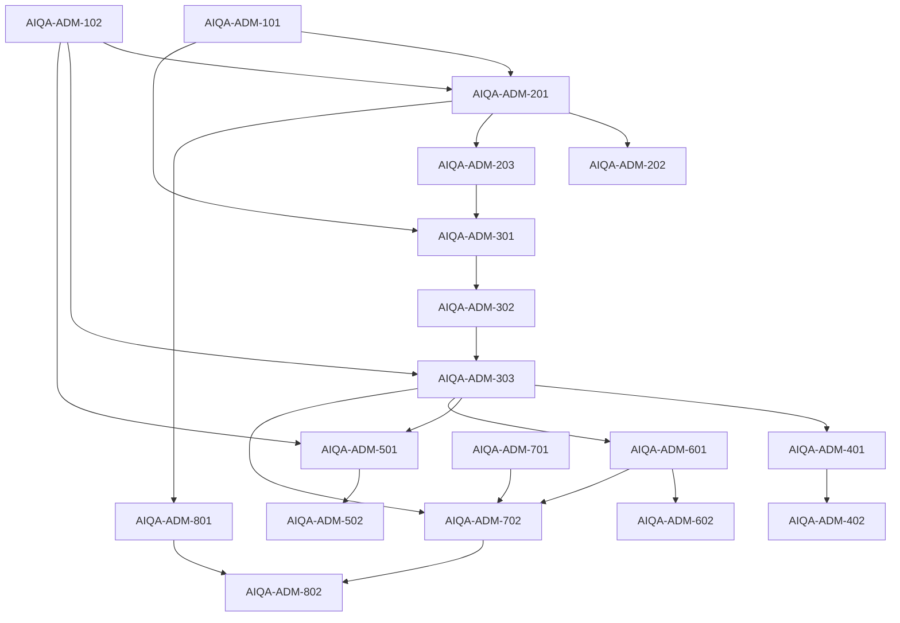

# Admin implementation plan

## Как использовать

Этот backlog описывает расширение существующей админки. Он намеренно не
фиксирует frontend framework, package layout или state library.

Перед task агент обязан:

1. прочитать [../README.md](../README.md);
2. прочитать [CONTEXT.md](CONTEXT.md);
3. найти фактическую admin frontend codebase и её conventions;
4. прочитать [USER_FLOWS.md](USER_FLOWS.md),
   [SCREEN_SPECS.md](SCREEN_SPECS.md) и [API_AND_STATE.md](API_AND_STATE.md)
   sections, указанные в task;
5. проверить backend dependency в
   [../be/API_CONTRACT.md](../be/API_CONTRACT.md).

Нельзя создавать новый admin application только потому, что его frontend нет
в текущем repository snapshot. Если actual admin code недоступен, task
остаётся blocked и implementer возвращает список требуемых integration
points.

## Dependency graph



## Минимальный vertical slice

```text
AIQA-ADM-101
  + AIQA-ADM-102
  + AIQA-ADM-201
  + AIQA-ADM-203
  + AIQA-ADM-301
  + AIQA-ADM-302
  + AIQA-ADM-303
  + AIQA-ADM-501
  + AIQA-ADM-502
```

Backend dependencies:

```text
AIQA-BE-101, AIQA-BE-102, AIQA-BE-201, AIQA-BE-202, AIQA-BE-301,
AIQA-BE-302, AIQA-BE-303, AIQA-BE-501, AIQA-BE-502
```

Результат: импорт fixture → sandbox ready → Ideas Quick Test → context preview
→ output → AI/human score 1–10 → Issue.

---

# Phase 1 — Foundation and contracts

## Exit criteria

- AI Tests section встроен в existing admin routing/navigation.
- Unauthorized/non-admin states используют существующий auth flow.
- Shared score/status/error components готовы.
- API types соответствуют backend contract.

## AIQA-ADM-101 — AI Tests route and admin integration

**Status:** blocked until actual admin frontend is available  
**Backend dependency:** AIQA-BE-102  
**Blocks:** all admin feature tasks

### Goal

Добавить AI Tests section в существующую админку без создания отдельного
application.

### Context

Information architecture описана в [CONTEXT.md](CONTEXT.md#information-architecture),
Home — в [SCREEN_SPECS.md](SCREEN_SPECS.md#1-ai-tests-home).

### Files

Implementer сначала фиксирует actual paths:

- admin route configuration;
- navigation;
- authorization wrapper;
- API client/config;
- page shell/layout.

Backend reference:

- `apps/api/src/api/admin/admin-api.routes.ts`;
- `/admin/qa` contract.

### Steps

1. Найти существующие admin route/navigation conventions.
2. Добавить `AI Tests` entry и child routes для Home, Profiles, Runs, Tests,
   Issues, System Versions.
3. Подключить existing admin auth guard.
4. Добавить generic not-authorized/not-found/error boundaries.
5. Не создавать пустые dashboard widgets.

### Acceptance criteria

- [ ] AI Tests открывается внутри existing admin layout.
- [ ] Direct URL/reload работает по admin routing convention.
- [ ] Non-admin не видит/не открывает section.
- [ ] Existing admin sections не изменились.
- [ ] Routes могут содержать Run/Profile/Case ID.

### Verification

- [ ] Existing frontend build/typecheck/lint commands.
- [ ] Manual navigation, reload, unauthorized.

### Out of scope

- Новый frontend stack/app.
- Feature screens.
- Backend auth redesign.

## AIQA-ADM-102 — Shared QA UI primitives

**Status:** ready after ADM-101  
**Backend dependency:** API contract only  
**Blocks:** Profile/Runner/Review screens

### Goal

Создать минимальные повторно используемые элементы AI-QA.

### Components

- Status badge.
- Score 1–10 control.
- Rubric criterion row with anchors.
- AI vs Human score display.
- Error block with stable code/retry.
- Context source badge.
- Async action button.
- Collapsible technical details.
- Empty state.

### Steps

1. Переиспользовать existing design system.
2. Добавить score keyboard/manual input.
3. Не полагаться только на цвет.
4. Добавить Story/examples в принятом admin convention, если он есть.

### Acceptance criteria

- [ ] Score принимает integer 1–10.
- [ ] Anchors доступны без hover-only behavior.
- [ ] AI/Human values различимы.
- [ ] Error component не показывает secrets/stack by default.
- [ ] Status labels единообразны.

### Verification

- [ ] Existing frontend checks.
- [ ] Manual keyboard/accessibility smoke check.

### Out of scope

- Новая общая design system.
- Charts.

---

# Phase 2 — Profiles and sandbox materialization

## Exit criteria

- Profiles можно импортировать/редактировать.
- Seed Assistant changes reviewable.
- Sandbox status понятен.

## AIQA-ADM-201 — Profiles list, import and detail

**Status:** blocked  
**Backend dependency:** AIQA-BE-201  
**Depends on:** AIQA-ADM-101, AIQA-ADM-102

### Goal

Дать оператору управляемую library Test Profiles.

### Context

Screens 2–4:
[SCREEN_SPECS.md](SCREEN_SPECS.md#2-profiles-list).
Flows 1–3:
[USER_FLOWS.md](USER_FLOWS.md#flow-1--first-use).

### Steps

1. List с search/segment/source/status filters.
2. New source chooser.
3. Bundled fixture import и generic JSON import according to available admin
   file/input conventions.
4. Structured detail editor.
5. Save/archive.
6. Отображать sandbox/out-of-date status.

### Acceptance criteria

- [ ] Три bundled fixtures доступны.
- [ ] Validation errors показывают field path.
- [ ] Draft можно сохранить без materialization.
- [ ] Large notes list остаётся usable.
- [ ] `expected_tasks` не создаёт Cases автоматически.

### Verification

- [ ] Existing frontend checks.
- [ ] Import/edit/reload/archive flows.
- [ ] Empty/filter/error states.

### Out of scope

- Seed Assistant.
- Real clone.
- Quick Test.

## AIQA-ADM-202 — Seed Assistant

**Status:** blocked  
**Backend dependency:** AIQA-BE-203  
**Depends on:** AIQA-ADM-201

### Goal

Создавать и локально менять structured Profile через свободный AI chat.

### Steps

1. Split view chat + draft.
2. Передавать selected paths.
3. Показывать assistant assumptions/message.
4. Local changes apply + Undo.
5. Bulk/destructive changes diff + Apply/Reject.
6. Handle stale draft revision.
7. Manual editor остаётся доступным при assistant error.

### Acceptance criteria

- [ ] Free-form brief создаёт visible structured draft.
- [ ] Локальная note edit не меняет другие sections.
- [ ] Bulk notes generation требует Apply.
- [ ] Undo работает до server save согласно admin convention.
- [ ] Materialization не запускается автоматически.

### Verification

- [ ] Existing frontend checks.
- [ ] Manual create/local/bulk/stale/error flows.

### Out of scope

- Hidden annotations.
- AI-generated Cases.
- Product chat.

## AIQA-ADM-203 — Sandbox materialization controls

**Status:** blocked  
**Backend dependency:** AIQA-BE-202  
**Depends on:** AIQA-ADM-201  
**Blocks:** AIQA-ADM-301

### Goal

Показать lifecycle подготовки Profile к реальным Runs.

### Steps

1. `Prepare sandbox` action.
2. Materializing progress/polling.
3. Ready summary counts.
4. Out-of-date warning after definition edit.
5. Rematerialize confirmation.
6. Failed state with Retry.

### Acceptance criteria

- [ ] Quick Test disabled until ready.
- [ ] Reload восстанавливает status.
- [ ] Rematerialize явно предупреждает о новом sandbox.
- [ ] Failure не скрывает Profile draft.

### Verification

- [ ] Existing frontend checks.
- [ ] ready/out-of-date/failed/rematerialize paths.

### Out of scope

- Real clone-specific consent.
- Background job dashboard.

---

# Phase 3 — Atomic Quick Test and smart context

## Exit criteria

- Home запускает atomic Test.
- Context preview показывает defaults/overrides.
- Runner восстанавливается после reload.

## AIQA-ADM-301 — Home Quick Test

**Status:** blocked  
**Backend dependencies:** AIQA-BE-201, AIQA-BE-301, AIQA-BE-701 or current resolver  
**Depends on:** AIQA-ADM-101, AIQA-ADM-203

### Goal

Сделать Quick Test primary admin action.

### Steps

1. Profile/System Version/mode/capability selectors.
2. Load capability catalog.
3. Show paused/recent Runs и small open Issues section independently.
4. Handle no Profiles/no versions/catalog error.
5. Continue to Context Preview.

### Acceptance criteria

- [ ] Ready Profile + capability выбираются за несколько действий.
- [ ] Secondary list errors не блокируют Quick Test.
- [ ] No dashboard charts.
- [ ] Deferred capabilities не запускаются.

### Verification

- [ ] Existing frontend checks.
- [ ] Empty/happy/error states.

### Out of scope

- Execute on Home.
- Suite batch.

## AIQA-ADM-302 — Smart Context Preview

**Status:** blocked  
**Backend dependency:** AIQA-BE-302  
**Depends on:** AIQA-ADM-301  
**Blocks:** AIQA-ADM-303

### Goal

Показать фактический product context и дать controlled overrides.

### Steps

1. Request preview on draft changes with appropriate debounce/manual action.
2. Compact rows + source badges.
3. Expand details.
4. Capability-specific input fields.
5. Add/remove/reset overrides.
6. Blocking/informational warnings.
7. Pass context hash to create Run.

### Acceptance criteria

- [ ] Changing relevant input invalidates old preview.
- [ ] Run disabled on blocking warning/stale preview.
- [ ] Product defaults и overrides визуально различимы.
- [ ] Generic advanced JSON не является primary control.

### Verification

- [ ] Existing frontend checks.
- [ ] Ideas/Post default/override/ambiguity cases.

### Out of scope

- Client-side context resolver.
- Prompt editing.

## AIQA-ADM-303 — Atomic Runner and Run Detail

**Status:** blocked  
**Backend dependency:** AIQA-BE-303  
**Depends on:** AIQA-ADM-102, AIQA-ADM-302  
**Blocks:** guided/review/cases/compare

### Goal

Выполнить atomic Step, показать output/details/errors и сохранить history.

### Steps

1. Create Run from preview.
2. Execute Step with duplicate-submit protection.
3. Render generic result and known Ideas/Post renderers.
4. Details drawer.
5. Retry same/edit input/context.
6. Finish/cancel.
7. Reload/resume by Run ID.
8. Runs list/detail.

### Acceptance criteria

- [ ] Atomic Ideas result доступен.
- [ ] Running/failed/completed states корректны.
- [ ] Retry сохраняет previous attempt.
- [ ] Reload не теряет output.
- [ ] Technical failure не отображается как quality score.

### Verification

- [ ] Existing frontend checks.
- [ ] Happy/failure/retry/reload/cancel.

### Out of scope

- Guided multi-step.
- Review.
- Compare.

---

# Phase 4 — Guided composite flows

## Exit criteria

- Linear Steps выполняются вручную.
- Selection передаётся далее.
- Strategy/Voice имеют dedicated readable renderers.

## AIQA-ADM-401 — Guided Step Runner

**Status:** blocked  
**Backend dependencies:** AIQA-BE-401, AIQA-BE-402  
**Depends on:** AIQA-ADM-303

### Goal

Расширить Runner на Notes→Ideas→Post и dynamic Continue.

### Steps

1. Linear progress.
2. Current Step focus и previous history.
3. Idea selection.
4. Continue/skip/stop according to nextActions.
5. Retry attempts.
6. Partial completion summary.
7. Atomic `Continue to ...` conversion when backend permits.

### Acceptance criteria

- [ ] Operator проходит Notes→Ideas→Post.
- [ ] Нельзя продолжить required selection без выбора.
- [ ] Quality score не блокирует Continue.
- [ ] Нет branch/DAG UI.
- [ ] Каждый Step сохраняет own output.

### Verification

- [ ] Existing frontend checks.
- [ ] Full happy flow, retry Ideas, stop partial, failed Post.

### Out of scope

- Automatic full execution.
- Arbitrary flow editor.

## AIQA-ADM-402 — Strategy and Voice Runner renderers

**Status:** blocked  
**Backend dependencies:** AIQA-BE-304, AIQA-BE-403  
**Depends on:** AIQA-ADM-401

### Goal

Сделать stateful Strategy/Voice flows понятными без изменения generic Runner.

### Steps

1. Strategy product conversation renderer.
2. Snapshot diff/tool actions.
3. Separate product message composer и Review Assistant.
4. Voice profile/rules/samples renderer.
5. Calibration feedback Step.
6. Cost/latency warning.

### Acceptance criteria

- [ ] Review Assistant message нельзя отправить Strategy Agent случайно.
- [ ] Before/after snapshot читаем.
- [ ] Voice sample review доступен.
- [ ] Operator может stop после любого allowed turn.

### Verification

- [ ] Existing frontend checks.
- [ ] Strategy 3-turn и Voice flow manually.

### Out of scope

- Product-facing Strategy/Voice UI redesign.
- Streaming.

---

# Phase 5 — AI/human review and Issues

## Exit criteria

- AI/human scores 1–10 видны отдельно.
- Operator сохраняет comment.
- Issue создаётся/закрывается явно.

## AIQA-ADM-501 — Review panel

**Status:** blocked  
**Backend dependencies:** AIQA-BE-501, AIQA-BE-502  
**Depends on:** AIQA-ADM-102, AIQA-ADM-303

### Goal

Добавить capability-specific AI review и быстрый human override.

### Steps

1. AI review pending/error/retry.
2. Overall/criteria scores + rationale/anchors.
3. Accept AI scores.
4. Human edit integer 1–10.
5. Optional comment.
6. Effective score display.
7. Per-Step и Run-level review.

### Acceptance criteria

- [ ] AI и human scores никогда не сливаются неразличимо.
- [ ] Invalid score нельзя отправить.
- [ ] Anchors доступны.
- [ ] Review failure не скрывает output.
- [ ] Human edit сохраняется после reload.

### Verification

- [ ] Existing frontend checks.
- [ ] AI-only, human override, review error, no review.

### Out of scope

- Calibration dashboard.
- Required comment on every score.

## AIQA-ADM-502 — Issues UI

**Status:** blocked  
**Backend dependency:** AIQA-BE-502  
**Depends on:** AIQA-ADM-501

### Goal

Создавать simple Issue из Step и проверять его через rerun.

### Steps

1. Mark Issue dialog prefilled from Step.
2. List filters.
3. Detail with origin Run.
4. Rerun action.
5. Open/fixed/ignored.
6. Link resolution Run.
7. Show open Issues on Home/Run/Case.

### Acceptance criteria

- [ ] Issue не создаётся без confirm.
- [ ] Severity/status clear.
- [ ] Fixed может ссылаться на rerun.
- [ ] Нет assignee/thread/sprint UI.

### Verification

- [ ] Existing frontend checks.
- [ ] Create/filter/rerun/fix/reopen.

### Out of scope

- External tracker sync.
- AI auto-close.

---

# Phase 6 — Cases and Suites

## Exit criteria

- Ad-hoc Run сохраняется как Case.
- Suite собирается из ordered Cases.
- Suite run — manual queue.

## AIQA-ADM-601 — Cases

**Status:** blocked  
**Backend dependency:** AIQA-BE-601  
**Depends on:** AIQA-ADM-303

### Goal

Сохранять полезные Runs и повторять их.

### Steps

1. Save as Case from Summary.
2. Prefill definition/rubric/segment.
3. List/filter/detail/edit/archive.
4. Run Case with selected System Version.
5. Show history/issues.

### Acceptance criteria

- [ ] Output не редактируется как golden expected.
- [ ] Edit warning объясняет future-only effect.
- [ ] Atomic/guided Cases поддержаны.
- [ ] Replay проходит через Context Preview при необходимости.

### Verification

- [ ] Existing frontend checks.
- [ ] Save/replay/edit/archive.

### Out of scope

- Case templates.
- AI auto-generation.

## AIQA-ADM-602 — Suites and guided queue

**Status:** blocked  
**Backend dependency:** AIQA-BE-602  
**Depends on:** AIQA-ADM-601

### Goal

Группировать Cases по segment и проходить их последовательно.

### Steps

1. Suite list/detail/create.
2. Add/remove/reorder Cases.
3. Baseline selection.
4. Start guided queue.
5. Finish/skip/next.
6. Summary scores/issues.

### Acceptance criteria

- [ ] Atomic и guided Cases могут быть в одном Suite.
- [ ] Queue не запускается background.
- [ ] Progress survives reload according to backend session contract.
- [ ] Summary остаётся compact.

### Verification

- [ ] Existing frontend checks.
- [ ] Founder Suite с несколькими Cases.

### Out of scope

- Schedule.
- Parallel/batch automation.
- Analytics trends.

---

# Phase 7 — System Versions and comparison

## Exit criteria

- Versions выбираются, но не редактируют runtime.
- Exact rerun понятен.
- Compare показывает outputs/scores/warnings/preference.

## AIQA-ADM-701 — System Versions

**Status:** blocked  
**Backend dependency:** AIQA-BE-701  
**Depends on:** AIQA-ADM-101

### Goal

Показывать/capture current baseline/candidate metadata.

### Steps

1. List/detail.
2. Capture dialog label/description/role.
3. Available/historical state.
4. Mark baseline/candidate/archive.
5. Version selector reusable by Quick Test/Case/Suite.

### Acceptance criteria

- [ ] Captured metadata read-only.
- [ ] No prompt/model editor.
- [ ] Unavailable version нельзя выбрать для new Run.
- [ ] Dirty flag заметен.

### Verification

- [ ] Existing frontend checks.
- [ ] Capture/list/select/archive.

### Out of scope

- Runtime switch implementation.
- Git checkout/deploy.

## AIQA-ADM-702 — Rerun and Compare

**Status:** blocked  
**Backend dependency:** AIQA-BE-702  
**Depends on:** AIQA-ADM-303, AIQA-ADM-601, AIQA-ADM-701

### Goal

Сравнивать baseline/candidate на exact context.

### Steps

1. Rerun dialog exact/product defaults.
2. Comparability warnings.
3. Side-by-side per Step.
4. Score deltas.
5. Optional AI diff.
6. Human preference baseline/candidate/tie/incomparable.
7. Mark regression Issue.

### Acceptance criteria

- [ ] Нет silent fallback exact→defaults.
- [ ] Context/rubric mismatches visible.
- [ ] Preference хранится отдельно от scores.
- [ ] Composite Steps aligned понятно.
- [ ] Baseline Run immutable.

### Verification

- [ ] Existing frontend checks.
- [ ] Comparable/mismatched/partial/error cases.

### Out of scope

- Statistical testing.
- Model tournament.
- Release gate.

---

# Phase 8 — Real clone, safety and polish

## Exit criteria

- Clone UX требует explicit consent/limits.
- Full manual journey проходит без dead ends.
- Accessibility/error/reload behavior проверены.

## AIQA-ADM-801 — Real-user clone UX

**Status:** blocked  
**Backend dependency:** AIQA-BE-801  
**Depends on:** AIQA-ADM-201

### Goal

Создавать sandbox clone без впечатления, что тест запускается на real user.

### Steps

1. Source user search/select.
2. Include/limit controls.
3. Privacy/read-only explanation.
4. Explicit confirmation.
5. Progress/result.
6. Source reference and sandbox distinction.

### Acceptance criteria

- [ ] Нет Run action на source user.
- [ ] Limits/contents видны до confirm.
- [ ] Clone failure не выглядит как source mutation.
- [ ] Sandbox label присутствует на resulting Profile.

### Verification

- [ ] Existing frontend checks.
- [ ] Confirm/cancel/failure/success.

### Out of scope

- Legal anonymization guarantees.
- Production data export tooling.

## AIQA-ADM-802 — End-to-end polish and hardening

**Status:** blocked  
**Backend dependency:** AIQA-BE-802  
**Depends on:** все завершённые v1 admin tasks

### Goal

Проверить весь solo workflow и убрать accidental complexity.

### Steps

1. Full fixture→Run→Review→Issue→Case→Candidate→Compare journey.
2. Reload/resume paused/failed Runs.
3. Permission/error states.
4. Accessibility score controls/forms.
5. Remove duplicate/unused controls.
6. Confirm no charts/team/CI/prompt editing leaked into v1.
7. Update docs/screens/API by actual implementation.

### Acceptance criteria

- [ ] Operator выполняет core journey без direct API calls.
- [ ] Все destructive actions confirm.
- [ ] No dead-end Run states.
- [ ] Mobile support не обязателен, но supported admin viewport usable.
- [ ] Technical details доступны, но не доминируют.
- [ ] Documentation соответствует UI.

### Verification

- [ ] Existing frontend full checks.
- [ ] Manual acceptance walkthrough on three synthetic Profiles.
- [ ] Unauthorized and backend failure walkthrough.

### Out of scope

- New features discovered during polish.
- Analytics/automation/team workflows.

---

# Cross-side coordination

При расхождении UI и API:

1. проверить [../be/API_CONTRACT.md](../be/API_CONTRACT.md);
2. зафиксировать конкретный mismatch;
3. обновить contract через согласованную backend task;
4. не воспроизводить backend state machine локальными hacks.

Admin task считается complete только когда backend dependency либо
реализована, либо заменена явно documented mock/stub, разрешённым для
параллельной разработки. Mock не является acceptance proof интеграции.
