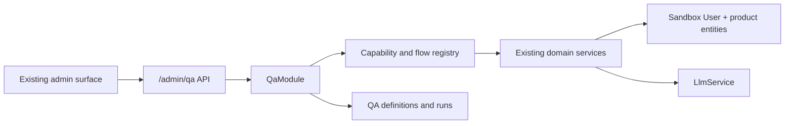
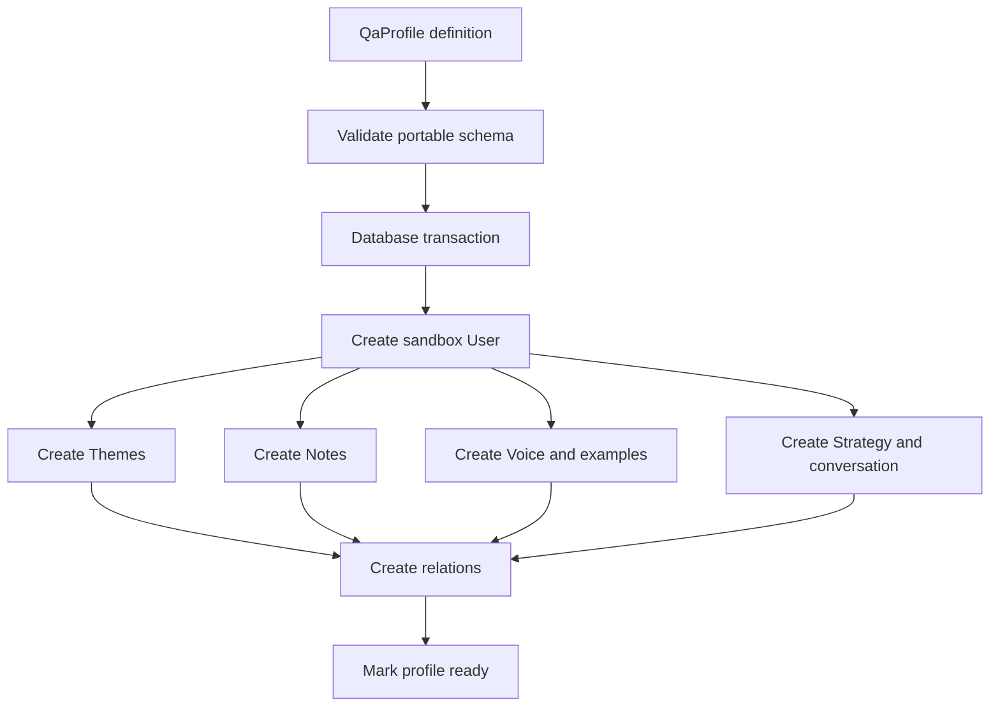

# Backend architecture

## Цель

Добавить к существующему NestJS backend минимальный orchestration и
persistence layer для ручного AI-QA, не дублируя product entities и не
превращая систему в универсальную evaluation platform.

Главный принцип:

> Product behavior выполняют существующие domain services. QA layer только
> готовит изолированный context, вызывает capability, сохраняет execution и
> помогает оценить результат.

## Высокоуровневая схема



## Package boundaries

Предлагаемая структура:

```text
apps/api/src/api/admin/qa/
  qa-api.module.ts
  qa-api.routes.ts
  profiles/
  capabilities/
  runs/
  reviews/
  cases/
  suites/
  issues/
  system-versions/

apps/api/src/modules/qa/
  qa.module.ts
  profiles/
  materialization/
  execution/
  review/
  cases/
  issues/
  system-version/

libs/db/src/entities/
  qa-profile.entity.ts
  qa-case.entity.ts
  qa-suite.entity.ts
  qa-run.entity.ts
  qa-review.entity.ts
  qa-issue.entity.ts
  qa-system-version.entity.ts
```

Controllers остаются thin. Capability execution и safety checks находятся в
`modules/qa`, а не в admin controllers.

## Минимальная persistence model

### Почему семь сущностей

v1 нужно хранить:

1. повторно используемый test profile;
2. повторно используемый test definition;
3. группы cases по сегментам;
4. executions;
5. AI/human reviews;
6. issues;
7. baseline/candidate metadata.

Отдельная `QaRunStep` table не обязательна в solo/manual v1. Steps можно
хранить как JSONB внутри Run: это уменьшает число сущностей и упрощает запись
guided state. Если позже потребуется сложная аналитика по миллионам steps,
их можно нормализовать отдельной migration.

### QaProfile

Назначение: definition тестового пользователя и связь с materialized sandbox.

Концептуальные поля:

```text
id
name
segment
source: ai_generated | fixture_import | real_clone
definition: jsonb
sandboxUserId: uuid | null
sourceUserId: uuid | null
status: draft | ready | materializing | failed | archived
materializationError: string | null
materializedAt
createdAt / updatedAt / deletedAt
```

`definition` хранит portable profile content, а не копию TypeORM rows.
Минимально поддерживаемые sections:

```text
profile
goals
pillars
toneRules
strategyState
notes.raw
notes.noisy
postSamples
```

Schema должна быть расширяемой, но server валидирует обязательный минимум для
каждой materialization operation.

### QaCase

Назначение: сохранённое определение atomic или guided test.

```text
id
name
segment
profileId
kind: atomic | guided
definition: jsonb
rubric: jsonb
createdFromRunId: uuid | null
status: active | archived
```

`definition` содержит:

- capability key или линейные step definitions;
- initial selections;
- context overrides;
- guided selections, если они были зафиксированы;
- exact/re-resolve context policy.

Case не хранит expected golden paragraph.

### QaSuite

Назначение: упорядоченная группа Cases для одного segment.

Минимальная модель:

```text
id
name
segment
description
caseIds: uuid[]
baselineSystemVersionId: uuid | null
defaultRubrics: jsonb
status: active | archived
```

Для v1 ordered `caseIds` в JSON/array допустимы. Если понадобится совместное
переиспользование Cases и сложное редактирование порядка, можно позже ввести
join entity.

### QaRun

Назначение: immutable history одного ad-hoc или saved test execution.

```text
id
profileId
caseId: uuid | null
suiteId: uuid | null
systemVersionId
operatorUserId
kind: atomic | guided
status: draft | ready | running | paused | completed | failed | cancelled
profileSnapshot: jsonb
systemVersionSnapshot: jsonb
rubricSnapshot: jsonb
contextPolicy: exact | product_defaults
resolvedContext: jsonb
steps: jsonb
summary: jsonb
startedAt / completedAt
```

Каждый element `steps`:

```text
key
order
capabilityKey
status
input
resolvedContext
output
artifacts
error
durationMs
startedAt / completedAt
operatorSelection
```

После completion Run не переписывается для нового candidate. Rerun создаёт
новый `QaRun` с `sourceRunId` внутри summary/metadata или отдельным nullable
полем, если связь нужна в UI.

### QaReview

Назначение: AI или human score для Run/Step.

```text
id
runId
stepKey: string | null
reviewerType: ai | human
reviewerUserId: uuid | null
overallScore: integer 1..10
criteria: jsonb
comment: text | null
createdAt / updatedAt
```

`criteria` содержит:

```text
[
  {
    key,
    label,
    score,
    rationale,
    anchorsSnapshot
  }
]
```

AI и human review — разные rows. Human не редактирует AI row.

### QaIssue

Назначение: минимальный quality/technical problem record.

```text
id
runId
stepKey: string | null
capabilityKey
title
description
severity: minor | major | critical
status: open | fixed | ignored
resolutionRunId: uuid | null
createdByUserId
createdAt / updatedAt
```

Issue не содержит assignee, sprint, comments thread или root-cause workflow.

### QaSystemVersion

Назначение: именованный snapshot доступной версии backend AI behavior.

```text
id
label
description
role: baseline | candidate | archived
codeRevision
isDirty
models: jsonb
prompts: jsonb
runtime: jsonb
createdAt
```

Prompt values не обязательно хранить целиком. Достаточно stable identifiers и
hashes, если exact text остаётся доступным по code revision.

## Sandbox isolation

### Требование

Ни atomic run, ни full flow не должны изменять production user data.

### Предлагаемая модель

1. `QaProfile` materialize создаёт отдельный `UserEntity`.
2. `UserEntity` получает явный marker `isQaSandbox`.
3. Sandbox email использует внутренний, уникальный namespace.
4. Все product entities создаются с `sandboxUserId`.
5. Executor перед вызовом проверяет marker.
6. Rematerialize удаляет/архивирует только sandbox user и создаёт новый.
7. `sourceUserId` real clone используется только для read.

Не полагаться только на email prefix: это удобная диагностика, но не
достаточный safety invariant.

### Separate database

Отдельная QA/staging database является предпочтительным production
deployment вариантом, особенно для real clones. Однако architecture должна
сохранять sandbox marker и при отдельной DB: он защищает от operator error и
помогает фильтровать данные.

## Profile materialization



Materializer должен переиспользовать domain services там, где их side effects
являются частью product behavior. Для bulk deterministic seed допустимы
специализированные store/repository операции, если они создают эквивалентное
валидное состояние и не вызывают ненужные LLM calls.

Пример: при materialization не нужно генерировать title каждой note через
LLM. Fixture name может использоваться напрямую.

## Capability registry

Capability registry — TypeScript-конфигурация с:

```text
key
label
description
input schema
context resolver
executor
output serializer
default rubric
supported transitions
```

Registry не является plugin platform. Добавление capability требует code
change и review.

Executor contract:

```text
execute({
  sandboxUserId,
  validatedInput,
  resolvedContext,
  priorArtifacts,
  systemVersion
}) → {
  output,
  artifacts,
  diagnostics
}
```

Executor вызывает существующий service и возвращает только serializable data.

## Smart context

Context resolution имеет две стадии:

1. preview без mutation;
2. execution с сохранённым resolved context.

`product_defaults` означает: использовать те же defaults и implicit choices,
что обычный application flow.

`exact` означает: повторно использовать IDs и values, сохранённые в source
Run. Exact mode является default для baseline/candidate comparison.

Manual overrides:

- валидируются capability input schema;
- явно сохраняются отдельно от defaults;
- видны в Run;
- не изменяют исходный QaCase автоматически.

## Atomic execution lifecycle

```text
Create draft Run
  → Preview context
  → Confirm
  → Mark running
  → Execute capability
  → Persist output/artifacts/error
  → Mark completed or failed
  → Trigger AI review
  → Save optional human review/issues
```

Retry создаёт новый Step attempt внутри активного draft/paused Run либо новый
Run, если исходный Run уже completed. Конкретное UI поведение должно сохранять
старый output.

## Guided execution lifecycle

```text
Create guided Run
  → Resolve first step
  → Execute
  → Review/select output
  → Resolve next step from artifacts + operator selection
  → Execute
  → ...
  → Complete Run
```

Guided flow линейный. Поддерживаемые действия:

- execute next;
- retry current;
- skip optional step;
- select one output;
- stop and complete partial run;
- cancel.

Нет произвольного jump между steps и visual branches.

## AI review

AI reviewer получает:

- capability description;
- profile snapshot, только релевантные sections;
- exact step input/context;
- output;
- rubric snapshot с anchors.

Он возвращает structured result:

```text
overallScore: 1..10
criteria: [{ key, score: 1..10, rationale }]
summary
suggestedIssue: optional
```

AI review:

- не создаёт Issue автоматически;
- не видит human review до собственной оценки;
- не изменяет product output;
- использует отдельный prompt identifier, включённый в System Version.

## System version capture

Минимальный snapshot:

- application code revision;
- dirty/clean indicator;
- main/fast/embedding/transcription model names;
- hashes или identifiers capability prompts;
- QA reviewer prompt identifier;
- relevant runtime feature flags.

Ограничение:

Сохранённый snapshot доказывает, что было заявлено для Run, но не умеет
самостоятельно поднять старый binary. Backend должен предоставлять только те
System Versions, которые реально доступны для execution в текущем
environment.

## Failure handling

Technical failures хранятся отдельно от quality scores:

- validation error;
- missing sandbox;
- context resolution error;
- LLM/API error;
- parse/schema error;
- persistence error;
- cancelled.

Failed step содержит sanitized error code/message. Secrets, full auth headers
и raw PII не должны попадать в Run.

## Observability v1

Обязательно:

- capability key;
- duration;
- model identifiers, если доступны;
- parse/validation status;
- artifact IDs;
- resolved context;
- technical error.

Опционально:

- tokens/cost, если SDK уже возвращает metadata;
- raw response для structured parse debugging с PII policy.

Не блокировать первый slice глобальным OpenTelemetry/LLM tracing проектом.

## Data retention

До отдельной policy:

- Profile и Case архивируются, а не hard-delete по умолчанию;
- sandbox user можно rematerialize/delete;
- completed Runs остаются immutable;
- real-clone snapshots требуют ограниченного retention и отдельного cleanup;
- Issues сохраняют ссылку на historical Run даже после archive Case.

## Security invariants

- Admin authorization проверяется server-side.
- Executor принимает только sandbox user.
- Real clone source читается, но не изменяется.
- Clone operation не копирует auth credentials/sessions.
- Run output не должен включать secrets.
- Profile import валидируется и имеет size limits.
- AI seed assistant не выполняет произвольные tools над production data.

## Extension points, не обязательные v1

- normalized RunStep table;
- headless runner;
- scheduled suites;
- judge calibration;
- trend analytics;
- external issue integration;
- richer LLM tracing;
- multiple operators/permissions;
- retention automation.
