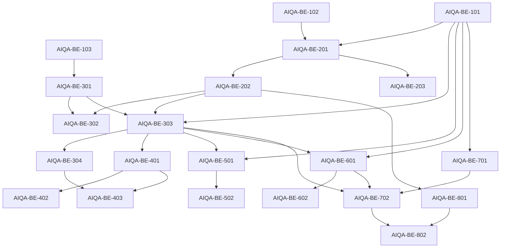

# Backend implementation plan

## Как использовать

Этот файл — исполнимый backlog backend AI-QA. Любой task можно передать
отдельному AI-агенту.

Перед выполнением любого task агент обязан прочитать:

1. [../README.md](../README.md);
2. [CONTEXT.md](CONTEXT.md);
3. [ARCHITECTURE.md](ARCHITECTURE.md);
4. sections из [API_CONTRACT.md](API_CONTRACT.md) и
   [CAPABILITIES_AND_FLOWS.md](CAPABILITIES_AND_FLOWS.md), указанные в task.

Task не разрешает выполнять соседние tasks «заодно».

Статусы в этом документе являются планом, а не отражением реализации:

- `ready` — решение достаточно определено;
- `blocked` — нужна dependency;
- `decision` — перед реализацией требуется уточнение;
- `future` — не входит в первый usable slice.

## Dependency graph



## Минимальный vertical slice

Первый полезный slice:

```text
AIQA-BE-101
  + AIQA-BE-102
  + AIQA-BE-103
  + AIQA-BE-201
  + AIQA-BE-202
  + AIQA-BE-301
  + AIQA-BE-302
  + AIQA-BE-303
  + AIQA-BE-501
  + AIQA-BE-502
```

Результат: импортировать fixture, materialize sandbox, preview context,
запустить `ideas.suggest`, получить AI review 1–10, сохранить human review и
issue.

---

# Phase 1 — Foundation and contracts

## Exit criteria

- QA entities и migration существуют.
- `/admin/qa` зарегистрирован и недоступен обычному app user.
- Capability/Run contracts имеют runtime validation.
- Пустые list endpoints видны в Swagger.

## AIQA-BE-101 — QA entities and migration

**Status:** ready  
**Depends on:** none  
**Blocks:** AIQA-BE-201, AIQA-BE-303, AIQA-BE-501, AIQA-BE-601, AIQA-BE-701

### Goal

Добавить минимальную persistence model для Profiles, Cases, Suites, Runs,
Reviews, Issues и System Versions, а также явный sandbox marker на User.

### Context

Target fields описаны в [ARCHITECTURE.md](ARCHITECTURE.md#минимальная-persistence-model).
Текущие entities находятся в `libs/db/src/entities/`, migrations —
`libs/db/src/migrations/`.

### Files

- Inspect:
  - `libs/db/src/common/base.entity.ts`;
  - `libs/db/src/entities/user.entity.ts`;
  - `libs/db/src/entities/index.ts`;
  - последние migrations в `libs/db/src/migrations/`.
- Create:
  - `libs/db/src/entities/qa-profile.entity.ts`;
  - `qa-case.entity.ts`;
  - `qa-suite.entity.ts`;
  - `qa-run.entity.ts`;
  - `qa-review.entity.ts`;
  - `qa-issue.entity.ts`;
  - `qa-system-version.entity.ts`;
  - migration.
- Modify:
  - `user.entity.ts`;
  - entities barrel exports.

### Steps

1. Перевести conceptual fields из Architecture в TypeORM columns/enums.
2. Использовать JSONB для profile definition, case definition/rubric,
   run snapshots/steps/summary и system metadata.
3. Добавить `isQaSandbox` boolean default false на User.
4. Определить foreign keys без cascade от real source user.
5. Добавить indexes для Run date/profile/case/version и Issue status.
6. Сгенерировать или написать migration в repository convention.

### Acceptance criteria

- [ ] Все семь QA entities экспортируются из `@app/db`.
- [ ] Existing users получают `isQaSandbox = false`.
- [ ] QA Review score ограничен integer 1–10.
- [ ] Deleting/archiving QaProfile не удаляет source real user.
- [ ] Run хранит steps и все required snapshots.
- [ ] Migration применима на существующей schema.

### Verification

- [ ] `pnpm build`.
- [ ] Применить migration на disposable/local DB.
- [ ] Создать и прочитать по одной row каждого QA entity через repository
      smoke check.

### Out of scope

- RunStep normalization.
- Team roles.
- Analytics aggregates.
- Seed data.

## AIQA-BE-102 — Admin QA route and authorization boundary

**Status:** ready  
**Depends on:** none  
**Blocks:** все HTTP tasks

### Goal

Зарегистрировать `/admin/qa` module и отдельную authorization boundary для
solo admin operator.

### Context

Текущий admin router находится в
`apps/api/src/api/admin/admin-api.routes.ts`, но `@Protected()` не проверяет
admin role.

### Files

- Inspect:
  - `apps/api/src/api/admin/admin-api.module.ts`;
  - `apps/api/src/api/admin/admin-api.routes.ts`;
  - `apps/api/src/modules/auth/guards/auth.guard.ts`;
  - `apps/api/src/api/internal/common/internal.guard.ts`;
  - config conventions.
- Create:
  - `apps/api/src/api/admin/qa/qa-api.module.ts`;
  - `apps/api/src/api/admin/qa/qa-api.routes.ts`;
  - admin QA guard/decorator/config as required.
- Modify:
  - admin module/routes;
  - config registration and environment documentation if needed.

### Steps

1. Зарегистрировать child route `qa` под existing `/admin`.
2. Ввести server-side allowlist или другой минимальный explicit admin check.
3. Не использовать sandbox user как operator.
4. Добавить health/catalog stub controller для Swagger verification.
5. Возвращать 401/403 согласно текущему exception convention.

### Acceptance criteria

- [ ] Allowed admin получает доступ.
- [ ] Обычный valid app user получает 403.
- [ ] Неавторизованный request получает 401.
- [ ] Route виден в Swagger под однозначным Admin / QA tag.
- [ ] Existing app/admin routes не изменили semantics.

### Verification

- [ ] `pnpm build`.
- [ ] Три manual requests: allowed, authenticated-not-admin, unauthenticated.

### Out of scope

- Полноценный RBAC.
- Изменение auth UI.
- Исправление legacy admin users/themes.

## AIQA-BE-103 — QA schemas and capability contracts

**Status:** ready  
**Depends on:** none  
**Blocks:** AIQA-BE-301

### Goal

Определить shared TypeScript/Zod contracts для capability registry, context,
steps и 1–10 rubric до реализации executor.

### Context

Без runtime schemas JSONB быстро станет неявным API. Contracts должны
соответствовать [ARCHITECTURE.md](ARCHITECTURE.md#capability-registry) и не
зависеть от конкретной capability.

### Files

- Create under `apps/api/src/modules/qa/types/`:
  - capability types/schema;
  - context types/schema;
  - run step types/schema;
  - rubric/review types/schema.
- Export through QA module barrel.

### Steps

1. Определить generic serializable executor result.
2. Определить context source enum.
3. Определить Run/Step status enums и legal transitions.
4. Определить rubric criterion с anchors и score 1–10.
5. Добавить helper для validation registry definitions at startup.

### Acceptance criteria

- [ ] Invalid capability definition fails fast during application bootstrap.
- [ ] Input/output types не требуют TypeORM entity serialization.
- [ ] Score 0/11 отклоняется.
- [ ] Context source различает product default, Case, operator override и
      prior Step.

### Verification

- [ ] `pnpm build`.
- [ ] Focused schema smoke checks для valid/invalid examples.

### Out of scope

- Реальные capabilities.
- HTTP DTO.
- Generic plugin loading.

---

# Phase 2 — Profiles and sandbox materialization

## Exit criteria

- Три existing fixtures импортируются как Profiles.
- Synthetic Profile materialize создаёт отдельного sandbox user.
- Rematerialize не затрагивает production users.
- Seed Assistant возвращает reviewable change proposal.

## AIQA-BE-201 — Profile CRUD and fixture import

**Status:** blocked  
**Depends on:** AIQA-BE-101, AIQA-BE-102  
**Blocks:** AIQA-BE-202, AIQA-BE-203

### Goal

Реализовать QaProfile CRUD и импорт `fixtures/creator_*.json`.

### Context

Fixture format описан в `fixtures/raw.md`, но не импортируется application
code. `expected_tasks` не materialize в product tables.

### Files

- Inspect:
  - `fixtures/*.json`;
  - existing list/controller DTO conventions.
- Create:
  - `apps/api/src/modules/qa/profiles/qa-profile.service.ts`;
  - fixture loader/validator;
  - `apps/api/src/api/admin/qa/profiles/*`.

### Steps

1. Определить portable profile validation schema.
2. Реализовать create/list/get/update/archive.
3. Добавить create-from-fixture by allowlisted fixture key.
4. Нормализовать snake_case fixture fields в canonical definition.
5. Не читать произвольный filesystem path из request.

### Acceptance criteria

- [ ] Все три fixtures импортируются.
- [ ] Invalid JSON/oversized definition отклоняется понятной ошибкой.
- [ ] List поддерживает pagination, segment/source/status filters.
- [ ] PATCH не rematerialize sandbox автоматически.
- [ ] `expected_tasks` доступен как suggestion metadata, не seed data.

### Verification

- [ ] `pnpm build`.
- [ ] Swagger/manual CRUD flow.
- [ ] Сравнить counts исходного fixture и canonical definition.

### Out of scope

- Materialization.
- AI generation.
- Real clone.

## AIQA-BE-202 — Synthetic profile materializer

**Status:** blocked  
**Depends on:** AIQA-BE-201  
**Blocks:** AIQA-BE-302, AIQA-BE-303, AIQA-BE-801

### Goal

Материализовать Profile в валидного sandbox user с Notes, Themes, Voice,
Strategy и relations.

### Context

Все product services фильтруют данные по userId. Materializer должен создать
изолированный мир, пригодный для реальных service calls.

### Files

- Inspect domain create APIs/services for user, note, theme, voice, strategy.
- Create:
  - `apps/api/src/modules/qa/materialization/qa-materializer.service.ts`;
  - mapping helpers and result DTO.
- Modify QA Profile controller/module.

### Steps

1. Validate Profile state и отсутствие existing active sandbox.
2. В transaction создать sandbox User с explicit marker.
3. Создать themes из pillars.
4. Создать notes из raw/noisy sets с deterministic names/order.
5. Создать voice и examples из post samples; явно решить, нужны ли embeddings
   для первого slice.
6. Создать Strategy snapshot из goals/strategy state, используя существующие
   defaults.
7. Связать strategy/themes/voice.
8. Сохранить sandboxUserId/counts/status.
9. Реализовать safe rematerialize через новый sandbox.

### Acceptance criteria

- [ ] Materialize founder fixture создаёт ожидаемые counts.
- [ ] Все rows принадлежат sandbox user.
- [ ] Executor safety check может доказать `isQaSandbox`.
- [ ] Ошибка transaction не оставляет partial ready Profile.
- [ ] Повторный materialize без confirmation не создаёт duplicate.
- [ ] Production user rows не меняются.

### Verification

- [ ] `pnpm build`.
- [ ] Materialize три fixtures в local DB.
- [ ] Прочитать данные существующими product list services.
- [ ] Negative check с non-sandbox user.

### Out of scope

- Audio/file assets.
- AI-generated profile.
- Real clone.
- Exact reproduction всех historical timestamps.

## AIQA-BE-203 — Seed Assistant

**Status:** blocked  
**Depends on:** AIQA-BE-201  
**Can run parallel with:** AIQA-BE-202

### Goal

По свободному описанию создать/изменить portable Profile definition через
structured, reviewable changes.

### Context

AI-first UX не означает, что LLM напрямую пишет в DB. Broad changes требуют
confirmation; published/materialized state не меняется молча.

### Files

- Create:
  - `apps/api/src/modules/qa/profiles/qa-seed-assistant.service.ts`;
  - structured prompt/schema;
  - profile assistant controller/DTO.
- Reuse `LlmService`.

### Steps

1. Определить structured change operations: set, append, replace, remove.
2. Передавать assistant только current definition и selected paths,
   необходимые для запроса.
3. Валидировать proposed result portable profile schema.
4. Классифицировать change как local или bulk.
5. Возвращать proposal с current draft revision.
6. Применение выполнить отдельным optimistic PATCH/action.

### Acceptance criteria

- [ ] Brief может создать valid draft profile.
- [ ] Команда о пяти selected notes не регенерирует остальные sections.
- [ ] Stale draft revision отклоняет apply.
- [ ] Bulk changes требуют explicit apply.
- [ ] Assistant не materialize и не читает production users.

### Verification

- [ ] `pnpm build`.
- [ ] Manual prompts: create, local edit, bulk noisy notes, invalid request.
- [ ] Проверить absence secrets/irrelevant DB data в prompt payload.

### Out of scope

- Hidden truth.
- Multi-agent author/critic pipeline.
- Автоматическое создание Cases.

---

# Phase 3 — Atomic Quick Test and smart context

## Exit criteria

- Catalog возвращает initial capabilities.
- Context preview совпадает с execution context.
- Atomic Run сохраняет input/output/artifacts/errors.
- Ideas, Post, Strategy и Voice можно добавлять независимо через registry.

## AIQA-BE-301 — Initial capability registry

**Status:** blocked  
**Depends on:** AIQA-BE-103  
**Blocks:** AIQA-BE-302, AIQA-BE-303

### Goal

Создать registry и первые wrappers: `ideas.suggest`, `post.create`,
`post.refine`.

### Context

Подробные contracts и rubrics:
[CAPABILITIES_AND_FLOWS.md](CAPABILITIES_AND_FLOWS.md).

### Files

- Create:
  - `apps/api/src/modules/qa/execution/qa-capability.registry.ts`;
  - per-capability definitions/resolvers/serializers.
- Import existing Idea/Post modules in `QaModule`.

### Steps

1. Реализовать registry lookup/list.
2. Для каждой capability определить input schema и default rubric.
3. Executor wrapper вызывает существующий service с sandbox userId.
4. Serializer исключает cyclic relations и sensitive data.
5. Вернуть artifact IDs.

### Acceptance criteria

- [ ] Catalog содержит три capabilities и их default rubric.
- [ ] Unknown key отклоняется.
- [ ] Wrapper не дублирует prompt/product generation logic.
- [ ] Every referenced ID проверяется на sandbox ownership.

### Verification

- [ ] `pnpm build`.
- [ ] Invoke wrappers programmatically на materialized Profile.

### Out of scope

- Guided flows.
- Strategy/Voice wrappers.
- Generic user-defined capabilities.

## AIQA-BE-302 — Smart context preview

**Status:** blocked  
**Depends on:** AIQA-BE-202, AIQA-BE-301  
**Blocks:** admin Quick Test

### Goal

Разрешать и объяснять product context до запуска без mutation.

### Context

API shape:
[API_CONTRACT.md](API_CONTRACT.md#context-preview). Exact preview должен быть
переиспользуем execution, а ambiguities не должны разрешаться случайно.

### Files

- Create:
  - `qa-context.service.ts`;
  - context ownership/order/hash helpers;
  - preview controller/DTO.

### Steps

1. Resolve selected notes/theme/active strategy/voice per capability.
2. Annotate source каждого context item.
3. Возвращать summaries и warnings.
4. Создать stable context hash по IDs/versions/values.
5. Проверять stale hash перед execution.

### Acceptance criteria

- [ ] Preview не создаёт/обновляет rows.
- [ ] Multiple active strategies дают ambiguity.
- [ ] Operator override виден отдельно.
- [ ] Все IDs принадлежат sandbox user.
- [ ] Exact request воспроизводит resolved context.

### Verification

- [ ] `pnpm build`.
- [ ] Preview для Ideas/Post с default и override.
- [ ] Negative cases: production ID, missing ID, ambiguous active state.

### Out of scope

- Retrieval ranking.
- UI formatting.
- LLM explanation call.

## AIQA-BE-303 — Atomic Run lifecycle and execution

**Status:** blocked  
**Depends on:** AIQA-BE-101, AIQA-BE-202, AIQA-BE-301, AIQA-BE-302  
**Blocks:** AIQA-BE-304, AIQA-BE-401, AIQA-BE-501, AIQA-BE-601, AIQA-BE-702

### Goal

Создать atomic Run, выполнить capability и сохранить полный execution record.

### Files

- Create:
  - `qa-run.service.ts`;
  - `qa-executor.service.ts`;
  - runs controller/DTO/OpenAPI.

### Steps

1. Реализовать Run/Step state transitions.
2. При create сохранить profile/system/rubric snapshots.
3. Перед execution повторно проверить sandbox/context/system version.
4. Mark running до external call.
5. Save output, artifacts, diagnostics, duration или sanitized error.
6. Поддержать retry attempts без потери предыдущего output.
7. Complete/cancel flow.

### Acceptance criteria

- [ ] Один atomic Ideas Run проходит end-to-end.
- [ ] LLM/parse failure сохраняется как failed Step.
- [ ] Повторный execute completed attempt отклоняется.
- [ ] Retry не удаляет первый attempt.
- [ ] Run snapshot остаётся после Profile edit.

### Verification

- [ ] `pnpm build`.
- [ ] Swagger/manual happy path.
- [ ] Simulate validation и execution failures.
- [ ] Проверить JSON serialization Post/Idea outputs.

### Out of scope

- Background queue.
- Batch execution.
- Partial rerun from arbitrary historical Step.

## AIQA-BE-304 — Strategy and Voice atomic capabilities

**Status:** blocked  
**Depends on:** AIQA-BE-303  
**Can run parallel with:** AIQA-BE-401

### Goal

Добавить `strategy.create`, `strategy.message`, `voice.adapt_text` и
`voice.calibration_start` согласно maturity limits.

### Context

Strategy требует snapshot/tool artifact serialization. Voice calibration
сама composite и может быть expensive.

### Steps

1. Добавить Strategy wrappers и state diff.
2. Зафиксировать conversation delta и tool side effects.
3. Добавить Voice adapt wrapper.
4. Добавить calibration start только после проверки materialized voice.
5. Добавить capability-specific rubrics.

### Acceptance criteria

- [ ] Strategy Step хранит response и before/after snapshot.
- [ ] Created theme/voice artifacts видны.
- [ ] Voice IDs sandbox-validated.
- [ ] Calibration failures не оставляют Run в running.
- [ ] Catalog показывает limitations.

### Verification

- [ ] `pnpm build`.
- [ ] По одному manual Run каждой capability.

### Out of scope

- Исправление product bugs Strategy/Voice.
- Theme suggest.
- Audio transcription asset management.

---

# Phase 4 — Guided composite flows

## Exit criteria

- Linear Run можно вести по одному Step.
- Operator selection передаётся следующему Step.
- Реализованы `notes_to_idea_to_post` и Strategy/Voice guided flows.

## AIQA-BE-401 — Guided Run state machine

**Status:** blocked  
**Depends on:** AIQA-BE-303  
**Blocks:** AIQA-BE-402, AIQA-BE-403

### Goal

Расширить Run lifecycle линейными Steps, pause/continue/select/skip.

### Steps

1. Добавить code-defined flow registry.
2. Создавать pending Steps из flow definition.
3. Реализовать current Step и allowed next actions.
4. Сохранять operator selection.
5. Resolve next input из prior artifacts.
6. Разрешить skip только optional Step.
7. Поддержать partial completion/cancel.

### Acceptance criteria

- [ ] Нельзя выполнить Step вне порядка.
- [ ] Selection валидируется по artifacts.
- [ ] Completed output не теряется после retry.
- [ ] UI получает nextActions с backend.
- [ ] Нет visual/DAG semantics в backend contract.

### Verification

- [ ] `pnpm build`.
- [ ] Synthetic two-step support flow.
- [ ] Invalid transition/selection/skip checks.

### Out of scope

- Branching.
- Parallel Steps.
- Background suite runner.

## AIQA-BE-402 — Notes → Ideas → Post flow

**Status:** blocked  
**Depends on:** AIQA-BE-401  
**Blocks:** first composite admin flow

### Goal

Реализовать центральный небольшой flow через Ideas и Post.

### Steps

1. Зарегистрировать `notes_to_ideas`.
2. Зарегистрировать `notes_to_idea_to_post`.
3. Передать selected idea в Post create.
4. Передать post artifact в refine.
5. Сохранить context и review targets каждого Step.

### Acceptance criteria

- [ ] Operator выбирает одну Idea.
- [ ] Post принадлежит тому же sandbox.
- [ ] Final Run показывает отдельные Idea/Post outputs.
- [ ] Failure Idea step не создаёт Post.
- [ ] Quality failure не блокирует manual continue.

### Verification

- [ ] `pnpm build`.
- [ ] Guided run на каждом из трёх fixtures.

### Out of scope

- Automatic best Idea selection.
- Publish/scheduling.
- Arbitrary custom flow editor.

## AIQA-BE-403 — Strategy and Voice guided flows

**Status:** blocked  
**Depends on:** AIQA-BE-304, AIQA-BE-401  
**Can run parallel with:** review tasks

### Goal

Добавить guided Strategy conversation, Strategy→Ideas→Post и
Voice calibration→Post.

### Steps

1. Strategy flow: create/select strategy и 3 editable scripted turns.
2. Expose snapshot diff per turn.
3. Compose Strategy artifacts into Idea resolver.
4. Voice flow: start calibration, optional feedback, create/refine sample post.
5. Сохранить operator messages/feedback exact.

### Acceptance criteria

- [ ] Operator может остановить Strategy после любого turn.
- [ ] Следующий turn использует обновлённую conversation.
- [ ] Voice feedback не отправляется без explicit action.
- [ ] Final Post review имеет доступ к использованной Strategy/Voice metadata.

### Verification

- [ ] `pnpm build`.
- [ ] Strategy flow на founder profile.
- [ ] Voice flow на reflective profile.

### Out of scope

- Automatic readiness decision.
- Endless free-form conversation runner.
- Fixing calibration product UX.

---

# Phase 5 — AI/human review and Issues

## Exit criteria

- AI review structured и 1–10.
- Human может override scores независимо.
- Issue создаётся явно и связывается с Step.

## AIQA-BE-501 — AI reviewer

**Status:** blocked  
**Depends on:** AIQA-BE-101, AIQA-BE-303  
**Blocks:** AIQA-BE-502

### Goal

Оценивать completed Step/Run по rubric snapshot через structured LLM output.

### Files

- Create QA review service, prompt builder/schema, review controller.

### Steps

1. Сформировать minimal evaluator context.
2. Не передавать human review.
3. Запросить overall/criteria scores 1–10 и rationales.
4. Validate response; сохранить AI QaReview.
5. Возвращать suggested issue только как text suggestion.

### Acceptance criteria

- [ ] Invalid score/criterion key отклоняется или безопасно repair/retry по
      явной policy.
- [ ] AI Review не изменяет Run output.
- [ ] Review prompt ID/hash входит в System Version snapshot.
- [ ] Повторный review создаёт новый attempt либо явное replacement policy.

### Verification

- [ ] `pnpm build`.
- [ ] Reviews Ideas/Post/Strategy.
- [ ] Проверить prompt payload на лишний context/PII.

### Out of scope

- Judge calibration.
- Human agreement analytics.
- Auto-created Issue.

## AIQA-BE-502 — Human review and Issues

**Status:** blocked  
**Depends on:** AIQA-BE-501

### Goal

Сохранять human scores/comments и простой Issue lifecycle.

### Steps

1. Реализовать create/update human review.
2. Валидировать score 1–10 и rubric keys.
3. Реализовать Issue CRUD/list filters.
4. Связать resolution Run.
5. Рассчитать effective score в response, не затирая AI/human.

### Acceptance criteria

- [ ] Human может изменить AI score.
- [ ] Обе оценки доступны.
- [ ] Issue создаётся только explicit request.
- [ ] Status поддерживает open/fixed/ignored.
- [ ] Issue stepKey валиден для Run.

### Verification

- [ ] `pnpm build`.
- [ ] Manual review/issue flow.
- [ ] Invalid score/status/foreign Step tests.

### Out of scope

- Threaded comments.
- Assignees.
- Automatic similarity clustering.

---

# Phase 6 — Cases and Suites

## Exit criteria

- Run сохраняется как reusable Case без golden output.
- Suite содержит ordered Cases одного segment.
- Manual suite session отдаёт следующий Case, но не запускает background batch.

## AIQA-BE-601 — Save and replay Cases

**Status:** blocked  
**Depends on:** AIQA-BE-101, AIQA-BE-303

### Goal

Создавать Case из полезного Run и повторно запускать его definition.

### Steps

1. Извлечь capability/flow, profile, inputs, context policy и rubric.
2. Не копировать output как expected golden.
3. Реализовать CRUD/archive.
4. `case/run` создаёт новый Run со snapshot.
5. Предупреждать, если Profile rematerialized и exact IDs unavailable.

### Acceptance criteria

- [ ] Atomic и guided Run сохраняются как Case.
- [ ] Edit Case влияет только на future Runs.
- [ ] Historical Run не меняется.
- [ ] Replay использует выбранную System Version.

### Verification

- [ ] `pnpm build`.
- [ ] Save/replay Ideas и full flow Cases.

### Out of scope

- Case template hierarchy.
- Automatic case generation.
- CI export.

## AIQA-BE-602 — Suites and manual suite sessions

**Status:** blocked  
**Depends on:** AIQA-BE-601

### Goal

Группировать ordered Cases по segment и поддержать guided queue.

### Steps

1. Suite CRUD/reorder.
2. Validate segment/profile compatibility как warning, не жёстко где
   допустим custom.
3. Создать manual suite session contract или lightweight progress metadata.
4. Вернуть next Case и summary completed Runs.

### Acceptance criteria

- [ ] Suite содержит atomic и guided Cases.
- [ ] Case order сохраняется.
- [ ] Нет background auto-run.
- [ ] Summary показывает review scores и open Issues.

### Verification

- [ ] `pnpm build`.
- [ ] Founder suite с минимум тремя Cases.

### Out of scope

- Scheduling.
- Parallel execution.
- Trend dashboards.

---

# Phase 7 — System Versions and comparison

## Exit criteria

- Runtime capture создаёт immutable System Version.
- Exact rerun сохраняет comparable context.
- Compare возвращает score/output deltas и warnings.

## AIQA-BE-701 — System Version capture

**Status:** blocked  
**Depends on:** AIQA-BE-101

### Goal

Снимать именованный snapshot current code/model/prompt/runtime metadata.

### Steps

1. Получить code revision и dirty flag безопасно для deployment.
2. Собрать model names из config/service definitions.
3. Hash capability-relevant prompt sources или использовать explicit prompt
   version constants.
4. Сохранить immutable snapshot.
5. Поддержать baseline/candidate labels/roles.
6. Не позволять UI менять actual runtime config.

### Acceptance criteria

- [ ] Два capture отличаются после prompt/model metadata change.
- [ ] Snapshot immutable.
- [ ] Unavailable old version нельзя выбрать для new execution без понятного
      warning/error.
- [ ] Secrets не сохраняются.

### Verification

- [ ] `pnpm build`.
- [ ] Capture current version twice и проверить stable hashes.

### Out of scope

- Checkout/build старого commit.
- Prompt editor.
- Model router UI.

## AIQA-BE-702 — Exact rerun and baseline/candidate compare

**Status:** blocked  
**Depends on:** AIQA-BE-303, AIQA-BE-601, AIQA-BE-701

### Goal

Повторить Case на candidate с тем же context и сравнить existing Runs.

### Steps

1. Реализовать rerun create с `exact`/`product_defaults`.
2. Для mutating flows создать свежий эквивалентный sandbox state.
3. Сравнить context/rubric hashes.
4. Вернуть per-step outputs, scores, deltas и comparability warnings.
5. Сохранить human preference и optional AI diff summary.

### Acceptance criteria

- [ ] Exact comparison обнаруживает context mismatch.
- [ ] Baseline Run не меняется.
- [ ] Candidate artifacts не попадают в baseline sandbox state.
- [ ] Different rubrics явно помечаются.
- [ ] Preference поддерживает baseline/candidate/tie.

### Verification

- [ ] `pnpm build`.
- [ ] Compare двух Ideas Runs.
- [ ] Compare composite Runs.
- [ ] Negative mismatched context/rubric checks.

### Out of scope

- Statistical significance.
- Multi-model tournament.
- Automatic release gate.

---

# Phase 8 — Real clone, safety and polish

## Exit criteria

- Real user копируется только read→sandbox write.
- Admin authorization, retention и PII handling проверены.
- Основные failure paths имеют понятные codes.

## AIQA-BE-801 — Real-user clone materialization

**Status:** blocked  
**Depends on:** AIQA-BE-202  
**Blocks:** AIQA-BE-802

### Goal

Создать QaProfile/sandbox из snapshot реального user без mutation source.

### Steps

1. Определить allowlisted clone options и limits.
2. Читать source entities с explicit userId.
3. Не копировать password/session/Telegram credentials.
4. Создать новый sandbox user и remap relations.
5. Опционально anonymize identity/PII.
6. Требовать explicit confirmation.
7. Сохранить source reference без cascade.

### Acceptance criteria

- [ ] Source rows before/after идентичны.
- [ ] Все cloned rows принадлежат sandbox.
- [ ] Relations remapped, а не ссылаются на source IDs.
- [ ] Limits предотвращают случайный огромный clone.
- [ ] Failure rollback не удаляет source.

### Verification

- [ ] `pnpm build`.
- [ ] Clone специально созданного local non-QA user.
- [ ] Compare source checksums/counts до/после.

### Out of scope

- Production cloning без отдельного operational approval.
- Cross-environment data transfer.
- Guaranteed legal anonymization.

## AIQA-BE-802 — Hardening, retention and operational review

**Status:** blocked  
**Depends on:** AIQA-BE-702, AIQA-BE-801

### Goal

Подготовить AI-QA backend к безопасному регулярному solo use.

### Steps

1. Провести auth/access review всех endpoints.
2. Проверить sandbox invariant во всех executors.
3. Добавить size/rate/cost limits для assistant/reviewer/runs.
4. Определить Run/Profile/clone retention и cleanup procedure.
5. Sanitize errors/logs.
6. Document operational backup/delete process.
7. Проверить Swagger и API contract drift.

### Acceptance criteria

- [ ] Нет admin QA endpoint без admin guard.
- [ ] Нет executor path для non-sandbox user.
- [ ] Secrets отсутствуют в snapshots/logs.
- [ ] Real clone можно удалить по documented procedure.
- [ ] Failure/retry paths не оставляют Run навсегда running.
- [ ] Documentation обновлена по фактическому contract.

### Verification

- [ ] `pnpm build`.
- [ ] `pnpm lint` в scope изменённых files.
- [ ] Manual abuse cases: oversized import, repeated execute, invalid IDs,
      non-admin, non-sandbox.
- [ ] Review DB records/logs на PII/secrets.

### Out of scope

- Enterprise compliance program.
- Team RBAC.
- CI/headless execution.

---

# Cross-side task mapping

Admin task dependencies указаны в
[../admin/IMPLEMENTATION_PLAN.md](../admin/IMPLEMENTATION_PLAN.md).

Backend implementer после изменения contract обязан:

1. обновить [API_CONTRACT.md](API_CONTRACT.md);
2. отметить affected `AIQA-ADM-*` dependencies;
3. сохранить backward-compatible semantics либо явно описать migration;
4. не реализовывать admin UI внутри backend task.
